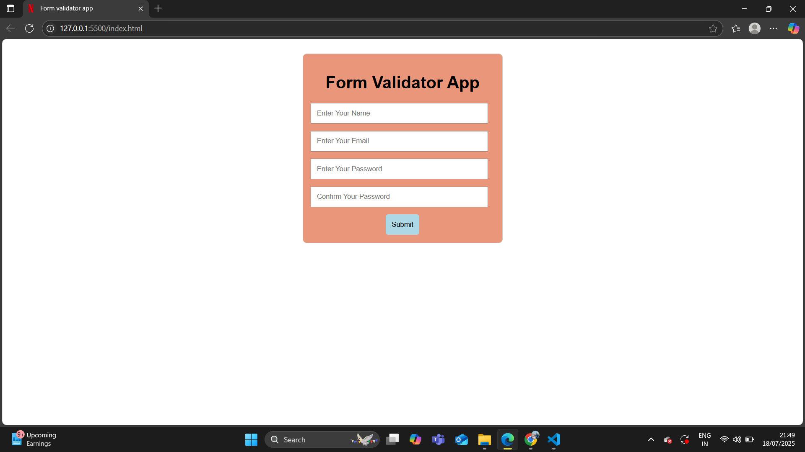

# ✅ Form Validator App

A simple JavaScript-based **Form Validator** that checks user inputs for:
- Name (Required)
- Email (Must contain `@` and `.`)
- Password (Minimum 8 characters)
- Confirm Password (Must match Password)

---

## 🚀 Features
✔ Real-time validation  
✔ Error messages for invalid inputs  
✔ Success message for correct input  
✔ Built with **HTML, CSS, JavaScript**  
✔ Beginner-friendly  

---

## 🖼️ Screenshot

---

## 🔗 Live Demo
[👉 Click Here to View Live](https://jaskaransingh2121.github.io/form-validator/)

---

## 🛠️ Technologies Used
- **HTML5**
- **CSS3**
- **JavaScript (ES6)**

